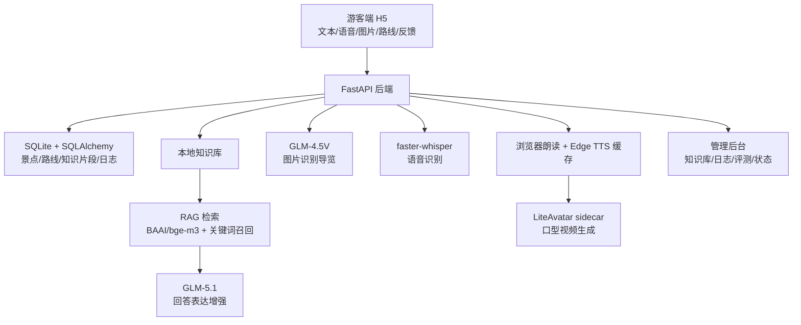

# 景区导览 AI 数字人 PPT 前四部分资料搜集

> 用途：对应目录页前四部分：1. 项目背景与目标；2. 系统架构；3. 核心能力实现；4. 测试与验证。第五部分“现场演示”由你自行上传视频，本稿不展开。  
> 建议用法：每一部分可拆 1 到 2 页 PPT。每页正文放“可放 PPT 的文字”，演讲时用“讲解口径”补充。

## 1. 项目背景与目标

### 1.1 行业背景

可放 PPT 的文字：

- 文旅行业正在从“线下讲解 + 静态标识”向“数字化、网络化、智能化服务”升级。
- 《“十四五”旅游业发展规划》提出推进智慧旅游，发展智慧导览、沉浸式互动体验、虚拟展示等新型旅游服务。
- 《智慧旅游创新发展行动计划》提出到 2027 年提升智慧旅游基础设施、管理水平、营销成效和游客服务体验，并鼓励景区探索人工智能导览等创新服务。
- 景区游客需求从“查信息”升级为“实时问答、个性推荐、语音讲解、图片识别、多语言服务和沉浸式呈现”。

讲解口径：

本项目不是单纯做一个聊天页面，而是顺应智慧旅游建设趋势，把景区导览中常见的“问路、问时间、问文化含义、问路线、拍照识别景点”等需求集成到一个 AI 数字人系统里。政策层面强调智慧导览、沉浸式体验和人工智能导览，项目的选题方向与这些场景高度一致。

可放成图表：

| 趋势 | 对应需求 | 本项目响应 |
|---|---|---|
| 智慧旅游建设 | 景区数字化服务 | H5 游客端 + 管理后台 |
| 人工智能导览 | 实时问答和讲解 | RAG + GLM-5.1 |
| 沉浸式体验 | 语音、数字人、图片识别 | GLM-4.5V + Edge TTS + LiteAvatar |
| 数据化运营 | 日志、反馈、评测 | 后台日志、数据大屏、50题评测 |

### 1.2 景区导览痛点

可放 PPT 的文字：

- 传统导览方式依赖人工讲解、固定展牌和地图，游客个性化问题难以及时响应。
- 景区信息具有强事实性，例如开放时间、演出场次、景点位置、服务设施，不能依赖大模型自由发挥。
- 游客真实问题表达多样，同一个问题可能被问成“几点表演”“什么时候能看”“今天有几场”，需要语义检索能力。
- 图片场景很常见，游客可能不知道景点名字，只能上传照片问“这是哪里”“有什么含义”。
- 语音和数字人可以提升亲和力，但如果音频和视频生成阻塞主问答链路，会造成等待时间过长。

讲解口径：

景区导览系统最关键的问题不是“能不能生成一段话”，而是“能不能讲对”。大模型直接回答景区事实容易编造，因此我们把本地知识库和 RAG 放在核心位置，让模型主要负责表达和补充，而不是凭空生成事实。

### 1.3 项目定位

可放 PPT 的文字：

- 项目名称：A5 景区导览 AI 数字人系统。
- 示范景区：江苏无锡灵山胜境。
- 项目周期：2026 年 4 月 26 日至 2026 年 6 月 24 日，约 2 个月。
- 系统定位：基于本地景区知识库、多模态大模型和数字人展示的智能导览系统。
- 核心原则：先做闭环，再做增强；先保正确，再追求表现力。

一句话概括：

> 本地知识库负责事实，模型负责表达，数字人负责呈现，后台负责验证。

### 1.4 项目目标

可放 PPT 的文字：

| 目标类别 | 具体目标 |
|---|---|
| 游客端服务 | 支持文本问答、语音问答、图片识别导览、路线推荐、英文讲解、反馈评价 |
| AI 能力 | 接入本地知识库、RAG 检索、Embedding、多模态视觉模型、主模型回答增强 |
| 数字人表达 | 支持语音播报、口型同步、数字人视频讲解、待命状态和讲解状态切换 |
| 管理后台 | 支持知识库管理、日志查看、游客报告、AI 状态、RAG 状态和评测结果 |
| 工程交付 | 本地可运行、Windows 可复现、接口可查、数据可验证、异常可降级 |

目标拆解：

1. 建立本地景区知识库，保证景点介绍、文化含义、演出时间、服务设施等事实可控。
2. 构建 RAG 检索链路，使不同问法都能召回相关知识片段。
3. 接入多模态视觉模型，使游客上传图片后可以识别景点并生成导览讲解。
4. 实现语音与数字人讲解，提升游客交互体验。
5. 建立后台日志和评测机制，用数据证明系统稳定性和准确性。

### 1.5 成功标准

可放 PPT 的文字：

- 功能闭环：游客提问 -> 知识库/RAG -> 主模型润色 -> 文字首答 -> 语音/数字人讲解 -> 后台记录。
- 准确性：内部 50 题自建测试集通过率 100%，高于 90% 目标阈值。
- 响应速度：文本首答和路线推荐能快速返回，语音和视频采用异步生成，避免阻塞主链路。
- 稳定性：增强模块失败时自动降级，保留文字回答和基础语音，不影响问答主流程。
- 可展示性：游客端、管理后台、RAG 状态、多模态图片识别、数字人讲解均可用于答辩展示。

## 2. 系统架构

### 2.1 总体架构

可放 PPT 的文字：

```text
游客端 H5
  -> FastAPI 后端接口
  -> 本地 SQLite 数据库
  -> 知识库 / RAG / 路线推荐 / 日志
  -> GLM-5.1 文本回答增强
  -> GLM-4.5V 图片理解
  -> Edge TTS / faster-whisper 语音链路
  -> LiteAvatar 数字人视频
  -> 管理后台与评测系统
```

讲解口径：

系统采用前后端一体的本地演示架构。游客端 H5 负责交互，FastAPI 负责业务接口和静态页面挂载，SQLite 负责本地数据和知识库，AI 服务按能力拆分为文本问答、RAG 检索、多模态识别、语音和数字人。后台不是附属页面，而是验收证据入口，用来展示知识库、日志、状态和评测。

可放成架构图：



### 2.2 前端架构

可放 PPT 的文字：

- 游客端入口：`http://127.0.0.1:8000/app/`
- 页面形态：移动端优先的 H5 导览界面。
- 主要模块：问答输入、推荐问题、路线推荐、图片上传、语音输入、英文展开、数字人舞台、反馈评分。
- 交互策略：文字首答优先展示，音频和视频异步补齐，降低游客等待感。

讲解口径：

前端不是单纯的调试页面，而是面向游客的导览页面。游客可以用文字、语音或图片触发问答；系统先展示可读答案，再根据配置请求语音和数字人视频。这样即使语音或视频还在生成，游客也不会卡在空白等待状态。

### 2.3 后端架构

可放 PPT 的文字：

- 后端框架：FastAPI。
- 数据访问：SQLAlchemy ORM。
- 本地数据库：SQLite。
- 静态页面：FastAPI 直接挂载 `frontend` 目录到 `/app/`。
- 接口文档：`http://127.0.0.1:8000/docs` 自动生成。

核心接口：

| 接口 | 作用 |
|---|---|
| `POST /api/chat/text` | 文本问答 |
| `POST /api/chat/voice` | 语音识别后问答 |
| `POST /api/chat/image` | 图片识别导览 |
| `POST /api/recommend/route` | 个性化路线推荐 |
| `GET /api/chat/audio/{log_id}` | 查询音频和口型状态 |
| `GET /api/chat/video/{log_id}` | 获取数字人讲解视频 |
| `GET /api/admin/rag/status` | 查看 RAG 索引状态 |
| `POST /api/admin/rag/rebuild` | 重建向量索引 |
| `GET /api/admin/evaluation/latest` | 查看最近评测结果 |
| `POST /api/admin/evaluation/run` | 执行 50 题评测 |

讲解口径：

后端按“游客接口”和“管理接口”拆分。游客接口服务导览流程，管理接口服务验收和运营。FastAPI 的自动接口文档可以直接作为答辩时的技术证据，说明系统接口不是写死页面，而是有完整后端能力支撑。

### 2.4 数据与知识库架构

可放 PPT 的文字：

- 数据库采用 SQLite，适合本地演示、Windows 复现和轻量部署。
- 知识库由文档、知识片段和向量索引组成。
- 知识来源包括示例景点数据、路线数据、上传文档、官方材料导入。
- 支持 `.txt`、`.md`、`.docx`、`.xlsx` 文档导入。
- 知识片段可在后台查看、编辑、删除和重建索引。

数据表角色：

| 数据对象 | 作用 |
|---|---|
| `ScenicSpot` | 景点结构化信息，例如位置、文化含义、亮点、演出时间 |
| `RoutePreset` | 预设路线和兴趣偏好 |
| `KnowledgeDocument` | 知识文档元数据 |
| `KnowledgeChunk` | 文档切分后的知识片段 |
| `KnowledgeEmbedding` | 向量索引和哈希校验 |
| `QALog` | 问答日志、来源、耗时、音频和视频状态 |
| `DigitalHumanConfig` | 数字人名称、声音、景区边界等配置 |

讲解口径：

选择 SQLite 不是因为不会用向量数据库，而是因为当前知识规模较小，本地演示更需要稳定可复现。项目没有把知识库做成黑盒，而是把文档、片段、向量、日志都放在后台可查看，便于验收和排查。

### 2.5 AI 能力架构

可放 PPT 的文字：

| 能力 | 技术方案 | 项目中的角色 |
|---|---|---|
| 文本回答 | GLM-5.1 | 在知识库约束下进行表达增强 |
| 语义检索 | BAAI/bge-m3 | 将游客问题与知识片段做语义匹配 |
| 多模态识别 | GLM-4.5V | 识别上传图片中的景点 |
| 语音识别 | faster-whisper | 将游客语音转成文本问题 |
| 语音合成 | 浏览器朗读 + Edge TTS | 快速播报和服务端音频兜底 |
| 数字人 | LiteAvatar sidecar | 根据音频生成口型同步 MP4 |

讲解口径：

系统的 AI 能力不是一个模型包办所有事情，而是按职责拆分。视觉模型只负责“看图”，知识库负责“讲对”，文本模型负责“讲自然”，语音和数字人负责“讲出来”。这种拆分可以减少幻觉，也能降低单点失败风险。

## 3. 核心能力实现

### 3.1 本地知识库与 RAG

可放 PPT 的文字：

- RAG 的作用：把游客问题先映射到本地知识片段，再让模型基于召回内容回答。
- 本项目采用“向量召回 + 关键词召回 + 简单重排”的混合检索策略。
- Embedding 模型：`BAAI/bge-m3`，支持多语言、多粒度和多种检索方式。
- 向量存储：SQLite JSON，记录向量、维度、模型名称、内容哈希和更新时间。
- 降级策略：如果未配置 Embedding 或向量生成失败，保留关键词检索能力。

流程：

```text
文档导入
  -> 切分为知识片段
  -> 生成文本向量
  -> 存入 KnowledgeEmbedding
  -> 用户提问
  -> 语义召回 + 关键词召回
  -> 过滤结构化噪声和非当前景区内容
  -> 生成回答
```

讲解口径：

大模型直接回答景区问题容易把不确定内容说得像真的。RAG 的价值在于把“模型记忆”改成“可更新的外部知识”。我们的实现还做了内容哈希校验，如果知识片段更新，旧向量会被识别为失效，需要重建索引。

可放成“为什么不用重型向量库”：

| 方案 | 优点 | 当前取舍 |
|---|---|---|
| Chroma/FAISS/Milvus | 更适合大规模向量检索 | 当前景区知识规模不大，部署和复刻成本偏高 |
| SQLite JSON | 轻量、稳定、易复制、适合本地演示 | 当前阶段足够支撑答辩和知识库验证 |

### 3.2 范围控制与反幻觉

可放 PPT 的文字：

- 系统只回答当前景区知识库覆盖的问题，不做通用聊天机器人。
- 对天气、股票、外部景区、城市服务等问题进行范围识别。
- 对佛教文化和祈福类问题加入边界约束，不承诺功德收益、神迹保证或占卜预测。
- 对门票、停车、交通、服务设施等缺失信息，明确提示“知识库待补充”或建议咨询游客中心。

实现要点：

| 控制点 | 实现方式 |
|---|---|
| 当前景区范围 | 根据“灵山胜境、灵山大佛、九龙灌浴”等别名和景点名判断 |
| 外部地点识别 | 识别故宫、长城、徐州、南京等外部地点 |
| 实时信息限制 | 未启用联网天气查询时不编造天气 |
| 宗教表达边界 | 只做文化讲解，不做现实结果承诺 |
| 来源记录 | 每条回答保存 `answer_source` 和引用标题 |

讲解口径：

反幻觉不是靠一句提示词解决，而是由范围判断、知识召回、答案校验、模板兜底共同完成。比如用户问“今天徐州天气”，系统不会强行套用九龙灌浴模板，而是明确说明当前只接入灵山胜境本地知识库。

### 3.3 多模态图片识别导览

可放 PPT 的文字：

- 满足“至少一个多模态大模型作为核心能力支撑”的要求。
- 游客上传图片后，`GLM-4.5V` 先识别画面中可能的景点。
- 识别结果不会直接当最终答案，而是转成导览问题交给本地知识库/RAG 生成讲解。
- 输出内容包括：视觉摘要、匹配景点、知识库讲解、语音状态、数字人视频状态。

流程：

```text
游客上传景区图片
  -> 校验图片类型和大小
  -> GLM-4.5V 识别景点候选
  -> 匹配当前知识库中的合法景点名
  -> 转成“请介绍某景点/文化含义/演出时间”等导览问题
  -> 调用文本问答链路
  -> 返回多模态识别 + RAG 讲解
```

讲解口径：

视觉模型只负责观察图片，不负责编造景点历史和开放时间。比如识别出“九龙灌浴”以后，真正的讲解仍然来自本地知识库。这样既满足多模态要求，又保证事实可控。

可放 PPT 的字段说明：

| 字段 | 含义 |
|---|---|
| `vision_summary` | 视觉模型对图片内容的摘要 |
| `matched_spot` | 匹配到的景区景点 |
| `vision_model_name` | 当前使用的视觉模型 |
| `multimodal_source` | 多模态来源，例如 `GLM-4.5V + RAG知识库` |

### 3.4 语音交互与播报

可放 PPT 的文字：

- 输入侧：支持 `transcript` 文本，也支持上传音频文件由 faster-whisper 转写。
- 输出侧：浏览器本地朗读优先，服务端 Edge TTS 异步生成音频缓存。
- 语音文本会被裁剪成适合讲解的短文本，避免把引用来源、字段名、长段说明全部读出来。
- 如果 TTS 失败，文字回答仍然保留，不影响主问答。

关键取舍：

| 问题 | 处理方案 |
|---|---|
| 同步生成 MP3 等待太久 | 文字首答先返回，音频后台生成 |
| 浏览器朗读音色不完全统一 | 以响应速度优先，服务端音频作为兜底 |
| 长答案不适合完整朗读 | 提取 80 到 360 字左右的讲解文本 |
| 音频重复生成浪费时间 | Edge TTS 缓存相同文本音频 |

讲解口径：

游客体验上，最重要的是不要长时间等待。项目把“回答”和“音频/视频生成”拆开，先让游客看到答案，再补齐语音和数字人。这比等完整 MP4 生成完再展示更稳定。

### 3.5 数字人讲解

可放 PPT 的文字：

- 当前采用 LiteAvatar `avatar-only sidecar` 作为数字人展示层。
- A5 主系统负责问答、RAG、语音和日志；LiteAvatar 只负责根据音频生成带口型的人物视频。
- 不启动完整 OpenAvatarChat 的摄像头、ASR、RTC 聊天 UI，避免与主系统功能冲突。
- 失败时降级为文字和语音讲解，避免数字人模块拖垮主链路。

流程：

```text
问答结果
  -> 提取讲解文本
  -> Edge TTS 生成音频
  -> LiteAvatar sidecar 接收音频
  -> 输出 MP4
  -> 前端播放数字人讲解
```

讲解口径：

项目的数字人不是追求照片级真人视频，而是服务景区导览的轻量展示层。这样能保留“会说话、带口型”的演示效果，同时控制本地 CPU、显存和启动复杂度。

### 3.6 个性化路线推荐

可放 PPT 的文字：

- 支持按兴趣和游览时长推荐路线。
- 兴趣类型包括亲子休闲、自然风光、佛教文化、历史文化等。
- 支持结合用户历史问答推断偏好，例如近期多次询问“佛教文化”，路线推荐会偏向文化深度游。
- 输出路线名称、景点顺序、推荐理由、匹配兴趣和个性化依据。

讲解口径：

路线推荐没有完全依赖大模型生成，而是基于预设路线和规则评分。这样做的好处是结果稳定，适合景区导览这种强场景系统。

### 3.7 管理后台与运营验证

可放 PPT 的文字：

- 后台默认账号：`admin / admin123`。
- 支持知识库文档上传、预览、编辑、重新导入、片段增删改。
- 支持 RAG 状态查看和向量索引重建。
- 支持游客问答日志、满意度反馈、热门问题、情绪趋势、游客报告。
- 支持 AI 能力状态、音频状态、数字人视频状态和 50 题评测结果。

讲解口径：

后台的意义是证明系统不是“只会前台演示”。每一次问答都有日志、来源、耗时、音频状态和视频状态；知识库和 RAG 也可以被管理和验证。

## 4. 测试与验证

### 4.1 验证目标

可放 PPT 的文字：

- 功能正确性：文本、语音、图片、路线、翻译、反馈、后台接口均能运行。
- 知识准确性：景点事实类问题优先由本地知识库和 RAG 支撑。
- 范围控制：超出当前景区知识库的问题不乱答。
- 性能体验：文本首答快速返回，语音和视频异步生成。
- 稳定性：AI、TTS、数字人等增强模块失败时可降级。

### 4.2 静态检查与单元测试

可放 PPT 的文字：

| 检查项 | 命令 | 验证内容 |
|---|---|---|
| 前端语法 | `node --check frontend\app.js` | 检查游客端 JS 语法错误 |
| 后端编译 | `.venv\Scripts\python.exe -m compileall backend\app` | 检查 Python 模块可编译 |
| 单元测试 | `.venv\Scripts\python.exe -m unittest discover -s backend\tests` | 覆盖聊天范围、图片识别、音频、口型等 |

已有验收记录：

- 后端单元测试：14 个测试通过。
- 前端 JS 语法检查：通过。
- 后端编译检查：通过。

讲解口径：

测试不是只测页面能不能打开，而是同时覆盖前端语法、后端可编译性和核心服务逻辑。特别是范围控制和多模态字段，已经有独立单元测试验证。

### 4.3 50 题问答评测

可放 PPT 的文字：

- 自建 50 题测试集，覆盖事实问答、路线推荐、服务设施、范围边界、文化讲解和同义改写。
- 准确率阈值：90%。
- 延迟阈值：P95 小于等于 5 秒。
- 最近记录：50/50 通过，准确率 100%。
- 评测结论：开发回归测试达标，正式准确率以评审测试集为准。

题型覆盖：

| 类型 | 示例问题 | 验证点 |
|---|---|---|
| 景点事实 | 九龙灌浴几点开始表演 | 演出时间准确 |
| 文化含义 | 灵山大佛有什么文化含义 | 本地知识库讲解 |
| 路线推荐 | 我只有半天时间，怎么游览 | 路线模板和兴趣匹配 |
| 服务设施 | 有无停车地点 | 缺失信息兜底 |
| 范围边界 | 今天徐州天气 | 不启用联网天气时明确拒答 |
| 同义改写 | 九龙灌浴表演什么时候能看 | 语义召回能力 |

讲解口径：

50 题评测不是最终官方结论，而是开发回归工具。它能证明系统改动后不会把高频问题答坏，也能帮助发现范围控制、模板兜底、RAG 召回是否失效。

### 4.4 接口 Smoke Test

可放 PPT 的文字：

| 接口 | 测试内容 | 结果 |
|---|---|---|
| `/api/health` | 服务健康检查 | 返回 `ok` |
| `/app/` | 游客端页面 | HTTP 200 |
| `/api/chat/text` | “九龙灌浴几点开始表演” | 成功返回答案 |
| `/api/recommend/route` | 兴趣“历史文化”、时长“半天” | 成功返回路线 |
| `/api/admin/rag/status` | RAG 状态 | 可查看索引数量、模型、维度 |
| `/api/admin/ai/status` | AI 状态 | 可查看模型、视觉、TTS、数字人配置 |

已有实测数据：

- `POST /api/chat/text`，问题“九龙灌浴几点开始表演”，本地朗读优先模式，实测约 0.632 秒。
- `POST /api/recommend/route`，兴趣“历史文化”、时长“半天”，实测约 0.185 秒。
- `POST /api/chat/text`，问题“灵山大佛有什么文化含义”，服务端语音模式，首答约 0.625 秒，音频和视频异步生成。

讲解口径：

这里要区分“文本首答耗时”和“完整数字人视频就绪耗时”。游客最先感受到的是首答，视频可以异步补齐，因此系统没有把最慢的 MP4 生成放进主响应链路。

### 4.5 RAG 与知识库状态验证

可放 PPT 的文字：

验收记录中的 RAG 状态：

| 指标 | 结果 |
|---|---|
| RAG 启用 | true |
| Embedding 已配置 | true |
| Embedding 模型 | BAAI/bge-m3 |
| 向量维度 | 1024 |
| 已索引知识片段 | 40 |
| 总知识片段 | 50 |

说明：

- RAG 链路可用。
- 当前索引为 40/50，答辩前建议重新执行 `POST /api/admin/rag/rebuild`，让索引数量尽量更完整。
- 即使 Embedding 配置异常，系统仍保留关键词检索作为降级能力。

### 4.6 多模态图片识别测试

可放 PPT 的文字：

测试重点：

1. 图片类型校验：仅允许 PNG、JPG、WebP、AVIF、GIF。
2. 图片大小限制：默认最大 8MB。
3. 景点匹配限制：视觉模型只能匹配当前知识库中的景点，不能把外部地点作为导览答案。
4. 识别后导览：识别结果必须进入本地知识库问答链路。
5. 失败兜底：无法识别明确景点时，引导用户补充景点名称或上传更清晰图片。

单元测试覆盖：

- 视觉模型配置需要独立 API Key。
- `select_allowed_spot` 只返回当前景区景点。
- 构造视觉模型消息时包含图片 URL 和候选景点。
- 不泄露模型内部推理字段。
- 演示图片文件名可快速匹配已知景点，避免答辩时完全依赖在线模型。

讲解口径：

多模态能力有两个重点：一是接入视觉模型，二是控制它的输出范围。我们的系统不会让视觉模型随便说一个景点，而是限定在当前知识库景点里匹配，再交给 RAG 讲解。

### 4.7 稳定性与降级验证

可放 PPT 的文字：

| 风险点 | 降级方案 |
|---|---|
| 主模型不可用 | 返回本地知识库模板或关键词结果 |
| Embedding 不可用 | 降级为关键词检索 |
| 视觉模型不可用 | 返回多模态服务不可用提示，不影响文本问答 |
| TTS 生成慢 | 浏览器本地朗读优先，服务端异步生成 |
| 数字人生成失败 | 保留文字和语音讲解 |
| 外部问题 | 明确说明当前知识库未覆盖 |

讲解口径：

系统的稳定性不是靠“所有服务都必须成功”，而是靠“每个增强能力失败后主链路仍然可用”。答辩时可以强调：数字人、语音、多模态都是增强层，核心问答闭环不会被它们拖垮。

### 4.8 当前风险和改进项

可放 PPT 的文字：

- 数字人自然度目前属于可演示级别，不是照片级真人生成。
- 完整 MP4 生成受本机 CPU、缓存和预热状态影响，答辩前建议提前准备演示视频。
- RAG 索引曾显示 40/50，建议答辩前重建索引并截图。
- 50 题评测是自建开发回归集，不等于官方测试集最终结论。
- GPS 或实时定位功能当前未实现，若被问到可说明为后续扩展方向。

讲解口径：

这里要主动说明边界，避免老师觉得夸大。项目已经完成主线闭环，但数字人自然度、定位服务、知识库覆盖量仍可继续优化。

## 可直接拆成 PPT 页的建议

### 第 1 部分建议页

页标题：项目背景与目标  
页面重点：

- 智慧旅游政策趋势：数字化、网络化、智能化。
- 景区导览痛点：事实准确、个性化、图片识别、语音讲解。
- 项目目标：构建本地知识库 + RAG + 多模态 + 数字人的导览闭环。

### 第 2 部分建议页

页标题：系统架构  
页面重点：

- 放总架构图。
- 强调“游客端 H5 + FastAPI + SQLite + AI 服务 + 管理后台”。
- 用一句话收束：本地知识库负责事实，模型负责表达，数字人负责呈现。

### 第 3 部分建议页

页标题：核心能力实现  
页面重点：

- RAG 知识库：解决事实准确。
- GLM-4.5V 图片识别：满足多模态要求。
- 语音与数字人：提升导览体验。
- 范围控制：避免通用聊天和模型幻觉。

### 第 4 部分建议页

页标题：测试与验证  
页面重点：

- 静态检查、单元测试、Smoke Test。
- 50 题评测：50/50，通过率 100%，阈值 90%。
- RAG 状态和 AI 状态可在后台查看。
- 诚实说明：自建测试集用于开发回归，正式以评审测试集为准。

## 外部资料来源

1. 文化和旅游部等五部门，《智慧旅游创新发展行动计划》，2024-05-13。  
   https://zwgk.mct.gov.cn/zfxxgkml/zykf/202405/t20240513_952825.html
2. 国家发展改革委，《“十四五”旅游业发展规划》。  
   https://www.ndrc.gov.cn/fggz/fzzlgh/gjjzxgh/202203/t20220325_1320209.html
3. 文化和旅游部，《关于开展智慧旅游沉浸式体验新空间推荐遴选暨培育试点工作的通知》，2023-03-16。  
   https://zwgk.mct.gov.cn/zfxxgkml/zykf/202303/t20230316_940730.html
4. NeurIPS 2020, Retrieval-Augmented Generation for Knowledge-Intensive NLP Tasks。  
   https://proceedings.neurips.cc/paper/2020/hash/6b493230205f780e1bc26945df7481e5-Abstract.html
5. BAAI/bge-m3 模型卡。  
   https://huggingface.co/BAAI/bge-m3
6. GLM-V 官方仓库，GLM-4.5V 说明。  
   https://github.com/zai-org/GLM-V
7. LiteAvatar 官方仓库。  
   https://github.com/HumanAIGC/lite-avatar
8. edge-tts 官方仓库。  
   https://github.com/rany2/edge-tts
9. faster-whisper 官方仓库。  
   https://github.com/SYSTRAN/faster-whisper

## 项目内部依据

- `docs/答辩PPT规划-NotebookLM资料.md`
- `docs/项目研发过程总报告.md`
- `docs/项目验收报告与分工说明.md`
- `docs/正式验收记录-2026-06-24.md`
- `backend/app/main.py`
- `backend/app/services/rag.py`
- `backend/app/services/chat.py`
- `backend/app/services/vision.py`
- `backend/app/services/audio_tasks.py`
- `backend/app/services/digital_video.py`
- `backend/app/services/evaluation.py`
- `backend/tests/test_chat_scope.py`
- `backend/tests/test_vision_guide.py`
