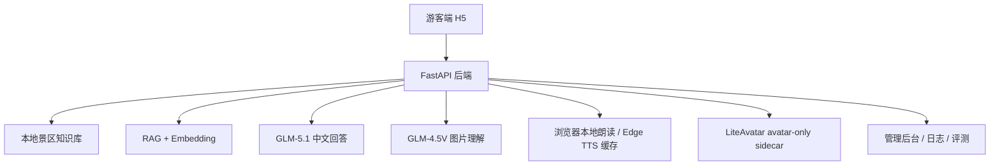

# A5 景区导览 AI 数字人项目研发过程总报告

> 说明：本文以”研发过程”为主线，验收结论只放在最后一节做锦上添花。  
> 项目入口：`http://127.0.0.1:8000/app/`  
> 后端文档：`http://127.0.0.1:8000/docs`  
> 当前工作分支：`codex/a5-research-doc-20260623`（整理文档中）  
> 主分支：`main`  
> 项目周期：2026年4月26日 - 2026年6月24日（约2个月）

## 1. 项目从哪里开始

这个项目不是从“做一个聊天页面”开始的，而是从“做一个能用于景区导览答辩的完整系统”开始的。题目真正要求的不是一个会聊天的模型，而是一套能在景区场景里闭环工作的系统：游客可提问，系统能基于本地知识给出导览回答，能支持语音、图片和数字人展示，后台还能看到知识库、日志和评测结果。

一开始我们最容易犯的错误有两个：

1. 把它做成通用聊天机器人，回答范围会发散，景区事实无法保证。
2. 把重点放在“数字人长什么样”，但真正答辩看的是“能不能稳定讲对话、讲事实、讲流程”。

所以项目启动后，我们先把目标收缩成一句话：

> 先做闭环，再做增强；先保正确，再追求表现力。

这个决策后面贯穿了整个研发过程。

## 2. 研发总策略

整个项目按四条主线推进：

1. **A 端后端闭环**：先把文本问答、知识库、日志、管理后台跑通。
2. **知识优先于生成**：事实类问题尽量由本地知识库和 RAG 约束，避免大模型乱编。
3. **展示层逐步增强**：语音、数字人、H5 视觉、图片识别这些都在闭环基础上逐个接入。
4. **失败可降级**：任何增强模块失败，都不能把主问答链路拖垮。

我们最后形成的不是“一个页面”，而是这条链路：

```text
游客提问
-> 语义判断与范围控制
-> 本地知识库 / RAG / 模板
-> 主模型补充表达
-> 文字首答立即返回
-> 本地朗读或服务端语音
-> 数字人讲解视频 / 口型展示
-> 后台日志、评测、状态监控
```

### 2.4 关键里程碑时间线

为了让研发过程更清楚，整个项目可以按下面的顺序回看：

1. **需求拆解**：先确认题目不是普通聊天机器人，而是景区导览闭环。
2. **A 端底座**：先做 FastAPI、SQLite、接口文档、静态前端挂载。
3. **基础问答**：先用模板和关键词跑通典型景区问题，验证答案方向。
4. **路线推荐**：再补兴趣关键词、游览时长和预设路线。
5. **前端 H5**：把原型页面逐步改成游客可用的移动端界面。
6. **RAG 升级**：把简单匹配升级为本地知识库 + 向量召回 + 重排。
7. **主模型补充**：接入 `GLM-5.1` 做表达增强，而不是放弃知识约束。
8. **多模态证据**：接入 `GLM-4.5V` 做图片理解导览。
9. **语音提速**：把同步生成 MP3 改成本地朗读优先、服务端异步回退。
10. **数字人增强**：从 2D 占位逐步过渡到 `LiteAvatar avatar-only sidecar`。
11. **范围控制**：加入超出景区知识库的问题拦截，避免答非所问。
12. **文档收束**：整理研发过程、验收说明、分工文档、复刻步骤和测试记录。

## 3. 研发过程的真实演进

### 3.1 第一步：先把 A 端骨架搭起来

项目最早先做的是后端骨架和静态前端。原因很简单：如果后端接口不稳定，前端做得再漂亮也没法验收。

这一阶段完成的事情包括：

- FastAPI 后端启动
- SQLite 本地数据库
- `/app/` 游客端入口
- `/docs` 接口文档
- 健康检查、基础配置、管理端入口

这一阶段的目标不是“好看”，而是“能跑”。

### 3.2 第二步：先做最稳的文本问答闭环

一开始我们没有直接上复杂 RAG，而是先做关键词、模板和基础问答。这样做的原因是：景区导览的高频问题其实很固定，例如开放时间、演出时间、游览路线、景点文化含义。

这个阶段的核心思路是：

- 高频固定问题先用模板答
- 事实性问题先用本地知识库约束
- 表达层再交给主模型润色

这样做的好处是稳定，坏处是早期看起来不够“智能”。但从答辩角度看，它更接近一个真实系统，而不是临时拼接的 Demo。

### 3.3 第三步：把本地知识库和 RAG 做实

项目后面真正的关键转折点，是把“简单关键词匹配”升级成“本地知识库 + RAG”。

我们最终没有上 Chroma、FAISS、Milvus 这类更重的向量库，而是选了 **SQLite JSON 向量存储**。原因有三个：

- 当前景区知识规模不大，SQLite 足够。
- Windows 本地打包更稳定。
- 队友复刻和答辩演示更简单。

Embedding 选的是 `BAAI/bge-m3`，知识片段先切块，再做向量召回，再用关键词召回补充，最后重排。这个过程解决了两个核心问题：

1. 用户问法和知识库原文不完全一致时，仍然能找得到。
2. 回答不会完全依赖大模型自由发挥，事实性更稳。

这一阶段后，我们开始把“系统是会回答”的问题，变成“系统是会答对”的问题。

### 3.4 第四步：补上多模态证据

题目要求里有“至少 1 个多模态大模型作为核心能力支撑”。这不是装饰项，而是验收硬要求。

所以我们把图片理解作为多模态入口，接入了 `GLM-4.5V`：

- 游客上传景区图片
- 视觉模型先判断画面里可能的景点
- 再把识别结果交给本地 RAG 生成讲解

这里的关键设计是分工明确：

- **GLM-4.5V** 负责“看图”
- **本地知识库** 负责“讲对”
- **数字人** 负责“讲出来”

这比单纯把图片当成附属功能更符合题目要求，也更能说明项目确实用了多模态模型。

### 3.5 第五步：语音链路不是换模型，而是控时延

我们很早就发现，真正拖慢体验的不是文本回答，而是语音生成。

实测里，Edge TTS 同步生成 MP3 的等待时间常常在 11 到 13 秒。这个数字对游客体验是不可接受的，所以我们没有简单地“换一个更大模型”，而是改了整体策略：

1. **浏览器本地朗读优先**
2. **服务端音频异步生成**
3. **Edge TTS 做缓存兜底**

这个调整的本质是：让游客先看到答案，再补语音，而不是等完整语音文件生成完再展示。

后面我们又验证了 MOSS 本地 TTS 方案，但在当前 Windows CPU 条件下不够稳定，最后没有放进主展示链路，而是作为试验记录保留。

### 3.6 第六步：数字人从“占位图”走向“可讲解的视频层”

数字人部分是整个项目最容易“看起来像样、实际上最难稳定”的模块。

我们一开始试过 2D/SVG 方案，也试过更完整的 OpenAvatarChat，但最终发现这类方案不是太像卡通，就是资源占用太重，和当前项目的稳定验收目标不匹配。

最后项目主线收敛到 **LiteAvatar avatar-only sidecar**：

- A5 主后端负责问答、RAG、语音
- LiteAvatar sidecar 只负责输出“会动、带口型的人物视频”

这条路线的意义在于：

- 避免把项目拖进完整摄像头、RTC、ASR、大模型全家桶
- 保留“数字人讲解”的核心表现
- 控制显存和 CPU 压力

所以我们不是在做一个通用虚拟主播，而是在做一个“服务景区讲解的轻量数字人展示层”。

### 3.7 第七步：前端从功能面板改成游客 H5

前端早期更像一个功能面板，后来我们逐步把它改成游客可用的 H5。

主要变化包括：

- 去掉过重的科技网格感
- 改成更适合游客浏览的手机优先布局
- 问答区、推荐问题、语音、图片、English、反馈都做成统一交互
- 数字人舞台不再只是角落占位，而是首屏视觉中心

我们一度把界面做得太“控制台化”，后来根据演示效果继续调整，尽量让游客看到的是“景区导览产品”，而不是“开发中的调试工具”。

### 3.8 第八步：把管理后台做成验证入口

后台不是摆设，而是为了证明系统不是只会前台演示。

我们保留了：

- 知识库管理
- RAG 状态
- AI 模型状态
- 游客日志
- 评测结果
- 满意度和热词统计

这让答辩时可以明确说明：前台是展示，后台才是完整闭环。

### 3.9 第九步：修正“答非所问”与范围发散

在开发中期，我们发现一个很实际的问题：模型有时会抓到关键词，但回答并不对应真正的问题。

因此我们加了范围控制：

- 当前景区外的问题明确拒答或提示知识库未覆盖
- 天气、门票、外部城市等不再强行套景区模板
- 只有在知识库能覆盖的范围内才进入导览回答

这一步很重要，因为它把系统从“什么都想答”变成“只答自己能负责的范围”。

### 3.10 第十步：文档、分支和验收材料整理

后期我们开始系统整理：

- 分支管理
- 提交记录
- 研发进程文档
- 分工说明
- 验收记录
- 复刻步骤

这不是纯行政工作，而是为了让项目可复现、可交接、可答辩。

## 4. 技术选型与开源项目

### 4.1 实际采用

| 项目 | 用途 |
|---|---|
| FastAPI | 后端服务与接口文档 |
| SQLite | 本地数据库与部署载体 |
| SQLAlchemy | ORM 和数据访问 |
| `BAAI/bge-m3` | Embedding 向量生成 |
| `GLM-5.1` | 中文回答表达与补充 |
| `GLM-4.5V` | 图片理解 / 多模态证据 |
| `edge-tts` | 中文语音合成 |
| `faster-whisper` | 本地语音识别 |
| LiteAvatar avatar-only sidecar | 数字人口型视频输出 |
| `python-docx` / `openpyxl` | 文档和表格材料整理 |

### 4.2 参考但没有作为主线

| 项目 | 角色 |
|---|---|
| MediaPipe Face Landmarker | 2D 仿生面部关键点参考 |
| Kalidokit | 表情参数映射参考 |
| Rhubarb Lip Sync | 口型时间轴参考 |
| OpenAvatarChat 完整 UI | 评估后放弃主线，改为 sidecar 思路 |
| Chroma / FAISS / Milvus | 未采用，当前规模不需要 |

### 4.3 为什么这样选

我们选型的原则不是“哪个最新”，而是“哪个最适合当前阶段的交付”。

如果把所有模块都换成重型方案，项目会更炫，但会更容易卡死；如果保留轻量链路，演示更稳，队友也更容易复刻。

## 5. 当前系统架构



这条架构的核心是：**本地知识库负责事实，模型负责表达，数字人负责呈现**。

## 6. 两人分工建议

为了让答辩时两个人都能独立讲完整链路，建议按“前后端/展示层”拆分，但每个人都要能讲清闭环。

### 6.1 你负责的部分：A 端与智能能力

- 项目背景和需求拆解
- 后端架构和数据库
- 本地知识库和 RAG
- `GLM-5.1`、`GLM-4.5V`、`BAAI/bge-m3`
- 事实性问答和范围控制
- 管理后台
- 评测与日志
- 性能、稳定性和边界控制

### 6.2 队友负责的部分：B 端与展示体验

- 游客端 H5 页面
- 文本、语音、图片入口
- 推荐问题和路线生成
- 数字人舞台、待命层、讲解层
- English 展开与播放
- 反馈、评分和滚动体验
- 手机端适配和视觉规范

### 6.3 如果队友临时不能到场

你至少要能讲这条完整链路：

```text
游客提问
-> 本地知识库 / RAG
-> 主模型补充表达
-> 文字首答
-> 语音 / 数字人补充
-> 后台记录与评测
```

## 7. 目前完成到什么程度

### 已完成

- 游客端 H5
- 文本问答
- 语音输入
- 图片识别导览
- 本地知识库
- RAG 检索
- 主模型补充
- 英文回答服务
- Edge TTS 缓存
- LiteAvatar 数字人口型视频
- 管理后台
- 日志与评测
- 50 题内部测试集

### 部分完成

- 数字人还属于轻量侧车，不是完整照片级真人模型
- 语音与视频仍受环境影响
- RAG 索引目前仍建议继续补齐

### 仍可继续优化

- 让数字人更自然
- 让本地 TTS 更快
- 让 RAG 覆盖更多题目
- 让答辩演示更稳定

## 8. 如何满足题目要求

### 8.1 多模态大模型

项目已经不是单纯文本问答，而是加入了图片理解导览。`GLM-4.5V` 负责图像理解，这是项目满足“至少一个多模态大模型”的关键证据。

### 8.2 本地景区知识库

所有景区事实类问题都优先走本地知识库和 RAG，不依赖模型自由发挥。

### 8.3 准确率要求

内部自建 50 题测试集当前通过率为 100%（50/50），但这只是开发验证，不等于官方评测结论。正式验收时应明确说明：

> 内部测试集用于开发回归，正式准确率以老师给定或专家确认的测试集为准。

### 8.4 语音与自然度

项目已经具备语音、口型、数字人讲解和待命层，但自然度仍属于“可演示”级别，不是照片级真人视频生成。

### 8.5 延迟与稳定性

文本首答已经被控制到较低时间；真正的瓶颈在语音和视频生成，所以我们采用“首答先出，音频异步补齐”的思路。

## 9. 研发过程里的关键取舍

有几个决定是整个项目最重要的：

1. **不用通用聊天机器人替代景区导览**，因为那会丢掉事实控制。
2. **不用重型向量数据库**，因为当前规模下 SQLite 更稳。
3. **不用完整 OpenAvatarChat UI**，因为资源开销和重叠功能太高。
4. **不用把语音生成阻塞到首答里**，因为游客等待时间太长。
5. **不用把所有问题都交给大模型自由回答**，因为会答非所问。

这些取舍最后决定了项目的形态：稳定优先，展示增强其次。

## 10. 验收时怎么讲

答辩时建议你把重点放在研发过程，不要先讲“怎么应对老师提问”。

最合适的讲法是：

1. 先讲题目要求和我们怎么拆解。
2. 再讲研发路线：后端闭环、知识库、RAG、多模态、语音、数字人、H5、后台。
3. 再讲为什么这样选型。
4. 最后再补验收结果和当前不足。

这份报告的定位也是这样：**过程是主线，验收是收尾**。

## 11. 验收补充

如果老师只看结果，你可以简单总结成：

- 系统能做景区导览问答
- 系统能用本地知识库约束事实
- 系统能处理图片导览
- 系统能展示数字人讲解
- 系统能导出日志和评测

但如果老师追问“你们怎么一步一步做出来的”，就回到本文第 3 节。

## 12. 结论

这个项目最终不是一个单点功能，而是一条完整的景区导览链路：

- 游客端可用
- 后端可查
- 本地知识库可控
- 多模态可证明
- 数字人可展示
- 过程可复盘
- 结果可验收

这也是我们从最初的 Demo 思路，逐步收敛到现在这套系统的真实研发过程。
